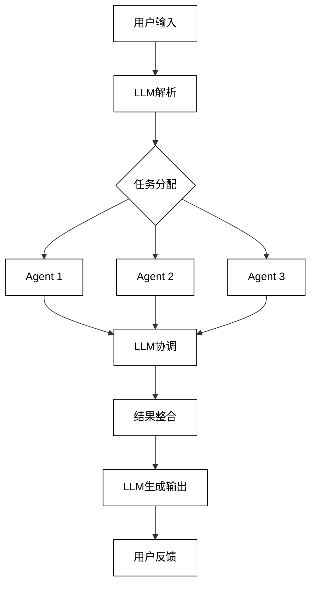

# 1 引言：LLM-based Multi-Agent系统概述

## 1.1 大语言模型(LLM)与Multi-Agent系统的融合

### 1.1.1 LLM的特性与能力

大语言模型（Large Language Models，LLM）是近年来自然语言处理领域最重要的突破之一。这些模型基于海量文本数据训练，具有以下关键特性和能力：

1. 自然语言理解：LLM能够深度理解人类语言的复杂性和细微差别，包括上下文、语义、情感等多个层面。

2. 生成能力：LLM可以生成连贯、流畅且符合上下文的文本，从简单的句子到复杂的段落甚至整篇文章。

3. 知识储备：通过预训练，LLM积累了大量的世界知识，涵盖各个领域和主题。

4. 任务适应性：LLM展现出强大的零样本和少样本学习能力，能够快速适应新的任务和领域。

5. 多语言支持：许多LLM支持多种语言，能够进行跨语言的理解和生成。

6. 上下文学习：LLM能够从给定的上下文中快速学习和推理，适应特定的场景和需求。

7. 创造性：LLM展现出一定的创造性，能够生成新颖的想法和内容。

这些特性使LLM成为构建智能系统的强大工具。以下是LLM能力的数学表示：

给定输入序列 $x = (x_1, ..., x_n)$，LLM的目标是最大化条件概率：

$$P(y|x) = \prod_{t=1}^m P(y_t|y_{<t}, x)$$

其中，$y = (y_1, ..., y_m)$ 是生成的输出序列。

### 1.1.2 Multi-Agent系统的基本概念

Multi-Agent系统是由多个智能代理（Agent）组成的分布式系统，这些Agent能够自主行动并相互协作以完成复杂任务。Multi-Agent系统的核心概念包括：

1. Agent：具有自主性、反应性、主动性和社交能力的计算实体。

2. 环境：Agent所处的外部世界，包括其他Agent和各种资源。

3. 交互：Agent之间以及Agent与环境之间的信息交换和行为影响。

4. 协作：多个Agent为实现共同目标而进行的合作行为。

5. 协调：管理Agent之间的依赖关系和资源分配。

6. 协商：Agent之间为解决冲突或达成共识而进行的交互过程。

7. 组织结构：定义Agent之间的关系和角色分配。

Multi-Agent系统的形式化定义可以表示为：

$$MAS = \{A, E, I, O\}$$

其中：
- $A = \{a_1, a_2, ..., a_n\}$ 是Agent集合
- $E$ 是环境
- $I$ 是交互协议集合
- $O$ 是组织结构

### 1.1.3 LLM赋能Multi-Agent系统的优势

LLM与Multi-Agent系统的融合为人工智能系统带来了多方面的优势：

1. 增强的通信能力：LLM使Agent之间能够使用自然语言进行更丰富、更灵活的交互。

2. 知识整合与共享：LLM作为知识库，可以为不同的Agent提供广泛的领域知识。

3. 动态任务分配：基于LLM的理解能力，系统可以更智能地分解和分配任务。

4. 适应性增强：LLM的快速学习能力使Multi-Agent系统能够更好地适应新环境和新任务。

5. 创新问题解决：结合LLM的创造性和Multi-Agent系统的协作能力，可以产生创新的解决方案。

6. 人机交互改善：LLM增强了系统与人类用户之间的自然语言交互。

7. 可扩展性：LLM可以帮助设计更灵活、可扩展的Agent架构。

下面是一个简化的Mermaid流程图，展示了LLM如何在Multi-Agent系统中发挥作用：



这个融合过程可以用以下数学模型表示：

给定任务 $T$，LLM-based Multi-Agent系统的目标函数可以表示为：

$$\max_{a_1,...,a_n} P(T|LLM(a_1,...,a_n))$$

其中 $a_1,...,a_n$ 表示不同的Agent，$LLM(a_1,...,a_n)$ 表示LLM对Agent输出的整合和理解。

## 1.2 LLM-based Multi-Agent系统的应用场景

LLM-based Multi-Agent系统的应用范围广泛，涵盖了多个领域和场景。以下详细探讨几个主要的应用场景：

### 1.2.1 智能对话与交互系统

在智能对话和交互系统中，LLM-based Multi-Agent系统可以显著提升用户体验和系统功能：

1. 客户服务：
    - 多个专业Agent处理不同类型的客户询问
    - LLM协调Agent响应，确保一致性和连贯性
    - 实时学习和适应新的客户需求

2. 虚拟助手：
    - 个人化Agent管理用户偏好和历史
    - 任务专门化Agent处理特定领域的请求
    - LLM整合多个Agent的输出，提供全面的助手服务

3. 教育对话系统：
    - 不同学科的专家Agent提供专业知识
    - 教学策略Agent设计个性化学习路径
    - LLM协调各Agent，提供连贯的教学体验

实现示例（Python伪代码）：

```python
class DialogueSystem:
    def __init__(self):
        self.llm = LargeLanguageModel()
        self.agents = {
            'customer_service': CustomerServiceAgent(),
            'product_expert': ProductExpertAgent(),
            'technical_support': TechnicalSupportAgent()
        }

    def process_user_input(self, user_input):
        # LLM解析用户输入
        intent = self.llm.analyze_intent(user_input)
        
        # 选择合适的Agent
        relevant_agents = self.select_agents(intent)
        
        # 收集Agent响应
        responses = [agent.respond(user_input) for agent in relevant_agents]
        
        # LLM整合响应
        final_response = self.llm.integrate_responses(responses)
        
        return final_response

    def select_agents(self, intent):
        # 根据意图选择相关Agent
        return [self.agents[agent_type] for agent_type in self.agents if self.is_relevant(intent, agent_type)]

    def is_relevant(self, intent, agent_type):
        # 判断Agent是否与意图相关
        return self.llm.check_relevance(intent, agent_type)
```

### 1.2.2 复杂问题解决与决策支持

LLM-based Multi-Agent系统在处理复杂问题和提供决策支持方面具有显著优势：

1. 科学研究协作：
    - 数据分析Agent处理大规模数据集
    - 模型构建Agent提出和验证假设
    - 文献综述Agent整合现有研究
    - LLM协调各Agent，生成研究报告和新的研究方向

2. 商业战略规划：
    - 市场分析Agent评估市场趋势
    - 财务预测Agent进行财务模拟
    - 风险评估Agent识别潜在风险
    - LLM整合各方面信息，提供全面的战略建议

3. 医疗诊断支持：
    - 症状分析Agent处理患者症状
    - 医学影像Agent分析医学图像
    - 药物相互作用Agent评估用药风险
    - LLM综合各Agent输入，协助医生做出诊断决策

实现示例（Python伪代码）：

```python
class ComplexProblemSolver:
    def __init__(self):
        self.llm = LargeLanguageModel()
        self.agents = {
            'data_analyst': DataAnalystAgent(),
            'model_builder': ModelBuilderAgent(),
            'literature_reviewer': LiteratureReviewerAgent()
        }

    def solve_problem(self, problem_description):
        # LLM分解问题
        sub_tasks = self.llm.decompose_problem(problem_description)
        
        results = {}
        for task in sub_tasks:
            # 选择合适的Agent
            agent = self.select_agent(task)
            # Agent执行任务
            result = agent.execute_task(task)
            results[task] = result
        
        # LLM整合结果
        solution = self.llm.integrate_results(results)
        
        return solution

    def select_agent(self, task):
        # 根据任务选择最合适的Agent
        return max(self.agents.values(), key=lambda agent: agent.suitability(task))
```

### 1.2.3 创意生成与协作创作

LLM-based Multi-Agent系统在创意生成和协作创作方面展现出独特的优势：

1. 多媒体内容创作：
    - 故事构思Agent生成创意概念
    - 角色设计Agent创建人物形象
    - 场景描述Agent构建环境细节
    - 视觉设计Agent生成配图或场景草图
    - LLM协调各Agent，整合创意元素，生成连贯的多媒体内容

2. 音乐创作：
    - 旋律生成Agent创作主旋律
    - 和声编排Agent设计和声结构
    - 节奏设计Agent创建节奏模式
    - 歌词创作Agent生成歌词
    - LLM整合各Agent输出，确保音乐元素的和谐统一

3. 广告创意：
    - 市场分析Agent提供目标受众洞察
    - 创意概念Agent生成广告主题
    - 文案撰写Agent创作广告文案
    - 视觉设计Agent构思广告画面
    - LLM协调各Agent，整合创意元素，形成完整的广告方案

实现示例（Python伪代码）：

```python
class CreativeCollaborationSystem:
    def __init__(self):
        self.llm = LargeLanguageModel()
        self.agents = {
            'story_conceptualizer': StoryConceptAgent(),
            'character_designer': CharacterDesignAgent(),
            'scene_descriptor': SceneDescriptionAgent(),
            'visual_artist': VisualArtistAgent()
        }

    def generate_creative_content(self, brief):
        # LLM解析创作需求
        requirements = self.llm.analyze_brief(brief)
        
        creative_elements = {}
        for req in requirements:
            # 选择合适的Agent
            agent = self.select_creative_agent(req)
            # Agent生成创意元素
            element = agent.create_element(req)
            creative_elements[req] = element
        
        # LLM整合创意元素
        final_content = self.llm.integrate_creative_elements(creative_elements)
        
        return final_content

    def select_creative_agent(self, requirement):
        # 根据创作需求选择最合适的Agent
        return max(self.agents.values(), key=lambda agent: agent.creativity_score(requirement))
```

### 1.2.4 知识管理与信息集成

LLM-based Multi-Agent系统在知识管理和信息集成方面具有强大的能力：

1. 企业知识库管理：
    - 信息采集Agent从各种源收集数据
    - 分类整理Agent对信息进行分类和标记
    - 更新验证Agent确保信息的时效性和准确性
    - 知识图谱Agent构建知识间的关联
    - LLM整合各Agent的工作，维护一个动态、全面的企业知识库

2. 跨学科研究支持：
    - 领域专家Agent提供各学科的专业知识
    - 关联分析Agent发现跨学科的联系
    - 趋势预测Agent识别新兴研究方向
    - LLM协调各Agent，促进跨学科知识的融合和创新

3. 个性化新闻聚合：
    - 信息收集Agent从多源获取新闻
    - 内容分析Agent理解新闻主题和观点
    - 用户兴趣Agent分析用户偏好
    - 推荐Agent根据用户兴趣筛选新闻
    - LLM整合各Agent输出，生成个性化新闻摘要

实现示例（Python伪代码）：

```python
class KnowledgeManagementSystem:
    def __init__(self):
        self.llm = LargeLanguageModel()
        self.agents = {
            'info_collector': InfoCollectionAgent(),
            'classifier': ClassificationAgent(),
            'validator': ValidationAgent(),
            'knowledge_graph': KnowledgeGraphAgent()
        }

    def process_information(self, raw_data):
        # 信息收集
        collected_info = self.agents['info_collector'].collect(raw_data)
        
        # 分类整理
        classified_info = self.agents['classifier'].classify(collected_info)
        
        # 验证validated_info = self.agents['validator'].validate(classified_info)
        
        # 构建知识图谱
        knowledge_graph = self.agents['knowledge_graph'].build(validated_info)
        
        # LLM整合知识
        integrated_knowledge = self.llm.integrate_knowledge(knowledge_graph)
        
        return integrated_knowledge

    def query_knowledge(self, query):
        # LLM解析查询
        parsed_query = self.llm.parse_query(query)
        
        # 在知识库中搜索
        relevant_info = self.agents['knowledge_graph'].search(parsed_query)
        
        # LLM生成回答
        answer = self.llm.generate_answer(relevant_info, query)
        
        return answer
```

## 1.3 研究现状与技术挑战

### 1.3.1 学术界研究热点

1. 大规模语言模型在Multi-Agent系统中的应用：
   研究者们正在探索如何有效地将LLM集成到Multi-Agent系统中，以增强Agent的语言理解和生成能力。主要关注点包括：
    - LLM作为Agent的决策引擎
    - 基于LLM的Agent间通信协议
    - LLM驱动的动态任务分配

2. 涌现智能（Emergent Intelligence）：
   探讨在LLM-based Multi-Agent系统中如何产生超越单个Agent能力的集体智能。研究方向包括：
    - 群体决策机制
    - 自组织行为模式
    - 复杂任务的分布式解决方案

3. 可解释性和透明度：
   随着系统复杂度的增加，提高LLM-based Multi-Agent系统的可解释性变得越来越重要。研究重点包括：
    - Agent决策过程的可视化
    - LLM推理路径的追踪
    - 系统行为的形式化描述

4. 持续学习与知识迁移：
   研究如何使LLM-based Multi-Agent系统能够从经验中学习并适应新环境。关键问题包括：
    - 跨域知识迁移
    - 增量学习策略
    - 长期记忆机制

5. 伦理AI与价值对齐：
   确保LLM-based Multi-Agent系统的行为符合人类价值观和伦理标准。研究方向包括：
    - 价值对齐算法
    - 伦理决策框架
    - 偏见检测与缓解

### 1.3.2 工业界应用进展

1. 智能客户服务：
   多家科技公司正在开发基于LLM的Multi-Agent客服系统，以提供全天候、多语言的客户支持。这些系统能够处理复杂查询，理解上下文，并提供个性化服务。

2. 协作写作平台：
   一些创新型初创公司正在构建LLM驱动的协作写作工具，利用多个专业Agent协助用户完成从创意构思到内容编辑的全过程。

3. 智能城市管理：
   大型科技公司正与政府合作，开发基于LLM-Multi-Agent的智能城市管理系统，用于交通优化、能源管理和应急响应等领域。

4. 金融分析与风险管理：
   金融机构正在采用LLM-based Multi-Agent系统进行市场分析、风险评估和投资组合管理，提高决策的准确性和效率。

5. 医疗诊断支持：
   一些医疗科技公司正在开发基于LLM的多Agent诊断支持系统，协助医生进行复杂病例的诊断和治疗方案制定。

### 1.3.3 关键技术挑战

1. 可扩展性：
   随着Agent数量和任务复杂度的增加，系统的计算需求呈指数级增长。如何设计高效的分布式架构以支持大规模LLM-based Multi-Agent系统是一个重要挑战。

   数学模型：
   假设系统中有 $n$ 个Agent，每个Agent的计算复杂度为 $O(f(m))$，其中 $m$ 是输入规模。系统的总体复杂度可能达到 $O(n \cdot f(m) + g(n))$，其中 $g(n)$ 表示Agent间协调的开销。

2. 一致性与冲突解决：
   在多Agent系统中，不同Agent可能产生矛盾的输出或决策。如何有效地检测和解决这些冲突，同时保持系统的一致性和可靠性是一个关键挑战。

   形式化描述：
   定义一致性函数 $C(A_1, A_2, ..., A_n)$，其中 $A_i$ 表示第 $i$ 个Agent的输出。目标是最大化：

   $$\max_{A_1, A_2, ..., A_n} C(A_1, A_2, ..., A_n)$$

   同时满足每个Agent的个体约束。

3. 隐私和安全：
   LLM-based Multi-Agent系统处理大量敏感数据，如何在保证系统功能的同时，保护用户隐私和数据安全是一个重要挑战。

   安全模型：
   定义隐私保护函数 $P(D, Q)$，其中 $D$ 是原始数据，$Q$ 是查询。目标是最小化信息泄露：

   $$\min_{P} I(D; P(D, Q))$$

   其中 $I$ 表示互信息。

4. 实时性能：
   许多应用场景要求系统能够快速响应。如何在保证决策质量的同时，提高LLM-based Multi-Agent系统的响应速度是一个重要挑战。

   性能指标：
   定义系统响应时间 $T$ 和决策质量 $Q$，目标是优化：

   $$\max_{system} \frac{Q}{T}$$

   subject to $T \leq T_{max}$，其中 $T_{max}$ 是最大允许响应时间。

5. 长期学习与适应：
   如何使LLM-based Multi-Agent系统能够从长期交互中学习并不断改进其性能，同时避免灾难性遗忘，是一个重要的研究方向。

   学习模型：
   定义系统在时间 $t$ 的性能为 $P_t$，学习目标可以表示为：

   $$\max_{learning\_strategy} \mathbb{E}[\sum_{t=1}^{\infty} \gamma^t P_t]$$

   其中 $\gamma$ 是折扣因子，表示对未来性能的重视程度。

6. 跨模态交互：
   随着应用场景的多样化，LLM-based Multi-Agent系统需要处理文本、图像、音频等多种模态的输入和输出。如何实现高效的跨模态理解和生成是一个重要挑战。

   跨模态融合模型：
   给定不同模态的输入 $x_1, x_2, ..., x_k$，目标是学习一个联合表示：

   $$z = f(x_1, x_2, ..., x_k)$$

   使得 $z$ 能够有效地捕捉所有模态的信息。

## 1.4 本书结构概览

本书共分为12章，系统地介绍了LLM-based Multi-Agent系统的理论基础、设计原则、实现技术和应用实践。以下是各章节的简要概览：

1. 引言：LLM-based Multi-Agent系统概述
    - 介绍LLM和Multi-Agent系统的基本概念
    - 探讨两者结合的优势和应用场景
    - 分析研究现状和技术挑战

2. LLM-based Multi-Agent系统的理论基础
    - 深入讲解大语言模型的工作原理
    - 阐述Multi-Agent系统的核心理论
    - 探讨LLM与Multi-Agent系统的结合点

3. LLM-based Multi-Agent系统架构设计
    - 提出系统架构设计原则
    - 讨论Agent设计模式
    - 分析通信与协调机制

4. LLM集成技术
    - 探讨LLM选择与评估方法
    - 介绍LLM微调与适应技术
    - 提供提示工程最佳实践

5. Agent设计与实现
    - 定义Agent角色与职责
    - 详解Agent内部架构
    - 讨论基于LLM的决策引擎实现

6. Multi-Agent协作机制
    - 提出基于对话的协作框架
    - 分析任务分解与分配策略
    - 探讨知识共享与集体决策机制

7. 用户交互与系统接口
    - 设计自然语言交互界面
    - 讨论多模态交互技术
    - 分析个性化与适应性交互策略

8. 系统评估与优化
    - 建立性能指标体系
    - 提供用户体验评估方法
    - 讨论系统优化策略

9. 案例研究与最佳实践
    - 分析多个实际应用案例
    - 总结行业最佳实践
    - 提供实施建议

10. 前沿研究方向与未来展望
    - 探讨大规模LLM-based Multi-Agent系统
    - 分析自主学习与进化方向
    - 讨论伦理AI与可信系统发展

11. 项目实践指南
    - 提供开发环境搭建指南
    - 讨论项目规划与管理策略
    - 分享常见问题解决方案

12. 总结与展望
    - 总结LLM-based Multi-Agent系统设计最佳实践
    - 分析常见陷阱与解决方案
    - 展望未来研究方向

每章节都包含详细的理论讲解、代码示例、案例分析和实践建议，旨在为读者提供全面、深入且实用的学习体验。通过系统性地学习本书内容，读者将能够掌握设计和实现LLM-based Multi-Agent系统的关键技术和方法，为在实际项目中应用这一前沿技术奠定坚实基础。