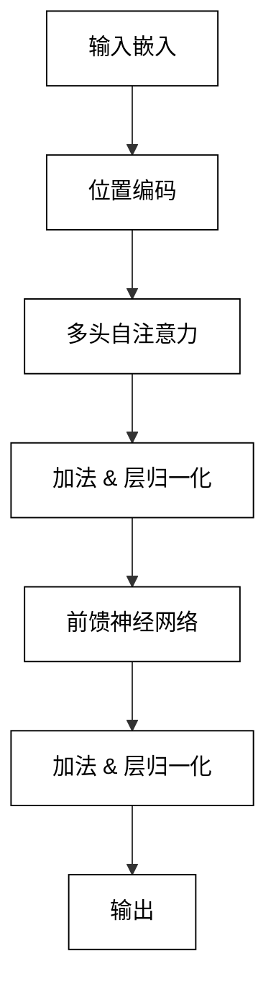
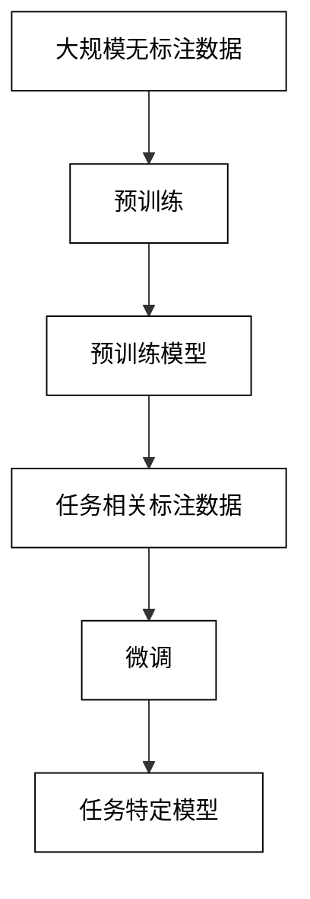
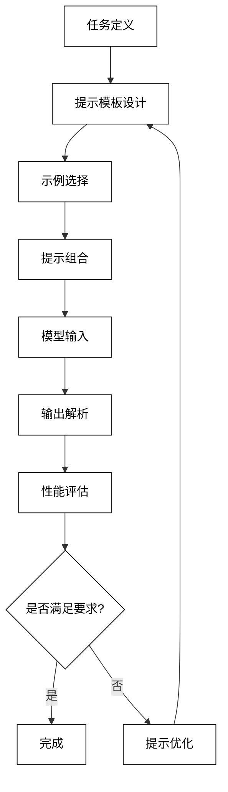

# 2 LLM-based Multi-Agent系统的理论基础

## 2.1 大语言模型基础

### 2.1.1 Transformer架构

Transformer架构是现代大语言模型的基石，它通过自注意力机制实现了高效的并行计算和长距离依赖建模。Transformer的核心组件包括：

1. 多头自注意力机制（Multi-Head Self-Attention）
2. 前馈神经网络（Feed-Forward Neural Network）
3. 层归一化（Layer Normalization）
4. 残差连接（Residual Connection）

多头自注意力机制的数学表示如下：

$$
\text{Attention}(Q, K, V) = \text{softmax}(\frac{QK^T}{\sqrt{d_k}})V
$$

其中，$Q$、$K$、$V$ 分别表示查询（Query）、键（Key）和值（Value）矩阵，$d_k$ 是键向量的维度。

多头注意力通过并行计算多个注意力头，进一步增强了模型的表达能力：

$$
\text{MultiHead}(Q, K, V) = \text{Concat}(\text{head}_1, ..., \text{head}_h)W^O
$$

其中，$\text{head}_i = \text{Attention}(QW_i^Q, KW_i^K, VW_i^V)$。

Transformer的整体架构可以用以下Mermaid流程图表示：



### 2.1.2 预训练与微调技术

大语言模型的训练通常分为两个阶段：预训练和微调。

1. 预训练：
    - 目标：在大规模无标注数据上学习通用语言表示
    - 常用方法：掩码语言模型（Masked Language Model, MLM）和下一句预测（Next Sentence Prediction, NSP）
    - 数学表示：
      对于MLM，给定上下文 $c$ 和被掩码的词 $w$，目标是最大化条件概率：
      $$
      \max_\theta \sum_{(w,c)} \log p_\theta(w|c)
      $$

2. 微调：
    - 目标：适应特定任务或领域
    - 方法：在预训练模型基础上，使用任务相关的标注数据进行进一步训练
    - 数学表示：
      对于分类任务，给定输入 $x$ 和标签 $y$，目标是最小化交叉熵损失：
      $$
      \min_\theta \sum_{(x,y)} -\log p_\theta(y|x)
      $$

预训练和微调的过程可以用以下Mermaid流程图表示：



### 2.1.3 少样本学习与提示工程

随着模型规模的增大，大语言模型展现出强大的少样本学习能力，这为提示工程（Prompt Engineering）的发展奠定了基础。

1. 少样本学习：
    - 定义：模型能够从少量样本中快速学习并适应新任务
    - 方法：包括零样本（Zero-shot）、单样本（One-shot）和少样本（Few-shot）学习
    - 数学表示：
      给定少量样本 $\{(x_i, y_i)\}_{i=1}^k$ 和新输入 $x_{new}$，目标是准确预测 $y_{new}$：
      $$
      p(y_{new}|x_{new}, \{(x_i, y_i)\}_{i=1}^k)
      $$

2. 提示工程：
    - 定义：设计和优化输入提示，以引导模型生成所需输出
    - 关键技术：
      a) 提示模板设计
      b) 示例选择
      c) 提示优化

提示工程的一般流程可以用以下Mermaid图表示：



提示工程的效果很大程度上依赖于提示的质量。一个好的提示应该清晰、具体，并且与任务紧密相关。以下是一个简单的提示工程示例代码：

```python
def generate_prompt(task, examples, input_text):
    prompt = f"Task: {task}\n\nExamples:\n"
    for example in examples:
        prompt += f"Input: {example['input']}\nOutput: {example['output']}\n\n"
    prompt += f"Now, please perform the task for the following input:\nInput: {input_text}\nOutput:"
    return prompt

# 使用示例
task = "Classify the sentiment of the given text as positive, negative, or neutral."
examples = [
    {"input": "I love this product!", "output": "Positive"},
    {"input": "This is terrible.", "output": "Negative"},
    {"input": "It's okay, I guess.", "output": "Neutral"}
]
input_text = "The movie was better than I expected."

prompt = generate_prompt(task, examples, input_text)
response = llm.generate(prompt)  # 假设llm是一个预训练的语言模型
print(response)
```

通过精心设计的提示，我们可以引导大语言模型执行各种任务，从简单的文本分类到复杂的推理和创作。在LLM-based Multi-Agent系统中，提示工程扮演着关键角色，它使得我们能够灵活地定义和调整Agent的行为和能力。

## 2.2 Multi-Agent系统理论

### 2.2.1 Agent的定义与类型

Agent是Multi-Agent系统的基本构建单元，它是一个能够自主感知环境并做出决策的计算实体。一个典型的Agent具有以下特征：

1. 自主性：能够独立做出决策和执行行动
2. 反应性：能够感知环境并对变化做出响应
3. 主动性：能够主动采取行动以实现目标
4. 社交能力：能够与其他Agent或人类进行交互和协作

Agent可以根据其特性和功能进行分类：

1. 反应式Agent：直接根据当前感知做出反应，不维护内部状态
2. 认知Agent：维护内部状态，能够进行推理和规划
3. 混合Agent：结合反应式和认知特性
4. 学习Agent：能够从经验中学习和改进

Agent的一般结构可以用以下数学模型表示：

$$
agent: S \times P \rightarrow A
$$

其中，$S$ 是环境状态集，$P$ 是感知集，$A$ 是行动集。

下面是一个简单的Agent类的Python实现：

```python
class Agent:
    def __init__(self, name):
        self.name = name
        self.state = None

    def perceive(self, environment):
        # 感知环境，更新内部状态
        pass

    def decide(self):
        # 根据内部状态做出决策
        pass

    def act(self, environment):
        # 执行决策，改变环境
        pass

    def update(self, environment):
        self.perceive(environment)
        action = self.decide()
        self.act(environment)
        return action
```

### 2.2.2 Multi-Agent交互模型

Multi-Agent系统中的交互是指Agent之间以及Agent与环境之间的信息交换和相互影响。主要的交互模型包括：

1. 直接通信：Agent之间通过消息传递直接交换信息
2. 间接通信：Agent通过改变环境状态间接传递信息（如蚁群算法中的信息素）
3. 协作：多个Agent共同努力实现共同目标
4. 竞争：Agent为了个体利益而相互竞争资源或目标
5. 协商：Agent通过交流和妥协解决冲突

交互模型可以用以下数学表示：

给定Agent集合 $A = \{a_1, a_2, ..., a_n\}$，环境状态 $s$，交互函数 $I$，则系统的下一个状态可表示为：

$$
s_{t+1} = I(s_t, a_1(s_t), a_2(s_t), ..., a_n(s_t))
$$

下面是一个简单的Multi-Agent交互系统的Python实现：

```python
class MultiAgentSystem:
    def __init__(self, agents, environment):
        self.agents = agents
        self.environment = environment

    def step(self):
        actions = []
        for agent in self.agents:
            action = agent.update(self.environment)
            actions.append(action)
        self.environment.update(actions)

    def run(self, steps):
        for _ in range(steps):
            self.step()
            self.environment.render()  # 可视化当前环境状态
```

### 2.2.3 协作与竞争机制

在Multi-Agent系统中，协作和竞争是两种基本的交互机制：

1. 协作机制：
    - 目标：多个Agent共同努力实现系统整体目标
    - 方法：任务分解、资源共享、信息交换
    - 挑战：协调开销、负载均衡、一致性维护

   协作的数学模型可以表示为最大化集体效用：

   $$
   \max_{a_1, ..., a_n} U(a_1, ..., a_n)
   $$

   其中 $U$ 是系统的整体效用函数，$a_i$ 是第 $i$ 个Agent的行动。

2. 竞争机制：
    - 目标：Agent追求个体利益最大化
    - 方法：策略博弈、资源竞争、市场机制
    - 挑战：公平性、效率、稳定性

   竞争可以用博弈论模型表示，例如Nash均衡：

   $$
   U_i(a_i^*, a_{-i}^*) \geq U_i(a_i, a_{-i}^*), \forall i, \forall a_i
   $$

   其中 $U_i$ 是Agent $i$ 的效用函数，$a_i^*$ 是均衡策略，$a_{-i}^*$ 表示其他所有Agent的均衡策略。

下面是一个简单的协作和竞争机制的Python实现示例：

```python
import numpy as np

class CollaborativeAgent(Agent):
    def decide(self):
        # 考虑团队利益的决策
        team_benefit = self.evaluate_team_benefit()
        return self.action_that_maximizes(team_benefit)

class CompetitiveAgent(Agent):
    def decide(self):
        # 考虑个人利益的决策
        personal_benefit = self.evaluate_personal_benefit()
        return self.action_that_maximizes(personal_benefit)

class MixedEnvironment:
    def __init__(self, collaborative_agents, competitive_agents):
        self.collaborative_agents = collaborative_agents
        self.competitive_agents = competitive_agents
        self.resources = np.random.rand(100)  # 随机初始化资源

    def update(self, actions):
        # 更新环境状态，分配资源
        collaborative_actions = actions[:len(self.collaborative_agents)]
        competitive_actions = actions[len(self.collaborative_agents):]
        
        # 协作agents平分一部分资源
        collab_share = sum(self.resources) * 0.6 / len(self.collaborative_agents)
        for agent in self.collaborative_agents:
            agent.resources += collab_share
        
        # 竞争agents根据actions竞争剩余资源
        remaining = sum(self.resources) * 0.4
        competitive_shares = self.allocate_competitively(competitive_actions, remaining)
        for agent, share in zip(self.competitive_agents, competitive_shares):
            agent.resources += share
        
        self.resources = np.random.rand(100)  # 资源重新生成

    def allocate_competitively(self, actions, remaining):
        # 简单的按比例分配
        total_action = sum(actions)
        return [a / total_action * remaining for a in actions]
```

在这个例子中，我们定义了协作型和竞争型Agent，以及一个混合环境。协作型Agent会考虑团队利益，而竞争型Agent则追求个人利益最大化。环境会根据不同类型的Agent采取不同的资源分配策略。

这种协作与竞争并存的机制在许多实际的Multi-Agent系统中都能找到应用，例如在经济模拟、交通管理、生态系统建模等领域。在LLM-based Multi-Agent系统中，我们可以利用大语言模型的能力来实现更复杂、更灵活的协作和竞争策略，从而构建出更加智能和高效的系统。## 2.3 LLM与Multi-Agent系统的结合点

### 2.3.1 LLM作为Agent的决策引擎

将LLM集成为Agent的决策引擎是LLM-based Multi-Agent系统的核心特征之一。这种集成方式使得Agent能够处理更复杂的任务，理解更丰富的上下文，并做出更智能的决策。

LLM作为决策引擎的主要优势包括：

1. 自然语言理解与生成：能够直接处理和生成人类可读的指令和响应。
2. 上下文感知：能够考虑长期依赖和复杂的上下文信息。
3. 知识整合：预训练过程中积累的广泛知识可以应用于决策过程。
4. 灵活性：通过提示工程可以快速适应不同的任务和场景。

LLM决策引擎的工作流程可以用以下数学模型表示：

给定当前状态 $s$，历史信息 $h$，和任务描述 $t$，LLM决策引擎输出动作 $a$：

$$
a = \text{LLM}(f(s, h, t))
$$

其中 $f$ 是将输入转换为适当提示的函数。

以下是一个简单的LLM-based Agent决策引擎的Python实现：

```python
class LLMAgent(Agent):
    def __init__(self, name, llm):
        super().__init__(name)
        self.llm = llm
        self.history = []

    def decide(self, state, task):
        prompt = self.create_prompt(state, task)
        response = self.llm.generate(prompt)
        action = self.parse_response(response)
        self.history.append((state, action))
        return action

    def create_prompt(self, state, task):
        context = f"Current state: {state}\nTask: {task}\n"
        history = "\n".join([f"State: {s}, Action: {a}" for s, a in self.history[-5:]])
        return f"{context}\nRecent history:\n{history}\n\nDecide the next action:"

    def parse_response(self, response):
        # 解析LLM的输出，提取动作
        return response.strip()

# 使用示例
llm = SomeLargeLanguageModel()  # 假设这是一个预训练的语言模型
agent = LLMAgent("LLM_Agent_1", llm)
state = "The room is dark and the door is locked."
task = "Find a way to exit the room."
action = agent.decide(state, task)
print(f"Decided action: {action}")
```

### 2.3.2 LLM辅助Agent间通信与理解

LLM在Agent间通信中可以发挥重要作用，主要体现在以下几个方面：

1. 消息翻译：将不同Agent的专有格式转换为通用的自然语言表示。
2. 意图理解：深入理解通信内容的潜在意图和语境。
3. 歧义消除：处理模糊或不完整的通信，提高理解的准确性。
4. 信息压缩与扩展：根据需要对通信内容进行压缩或扩展，保留关键信息。

LLM辅助通信的过程可以表示为：

$$
m_{ij} = \text{LLM}_j(\text{LLM}_i(m_i))
$$

其中 $m_i$ 是Agent i的原始消息，$\text{LLM}_i$ 将其转换为通用格式，$\text{LLM}_j$ 将通用格式转换为Agent j可以理解的形式。

以下是一个LLM辅助Agent通信的Python实现示例：

```python
class LLMCommunicationFacilitator:
    def __init__(self, llm):
        self.llm = llm

    def translate(self, message, from_agent, to_agent):
        prompt = f"""
        Translate the following message from {from_agent} to a format understandable by {to_agent}:
        
        Original message: {message}
        
        Translated message:
        """
        return self.llm.generate(prompt).strip()

    def interpret_intent(self, message):
        prompt = f"""
        Analyze the intent of the following message:
        
        Message: {message}
        
        Intent:
        """
        return self.llm.generate(prompt).strip()

# 使用示例
facilitator = LLMCommunicationFacilitator(llm)

message = "Initiate protocol alpha-3 in sector 7."
from_agent = "CommandAgent"
to_agent = "ExecutionAgent"

translated_message = facilitator.translate(message, from_agent, to_agent)
intent = facilitator.interpret_intent(message)

print(f"Translated message: {translated_message}")
print(f"Interpreted intent: {intent}")
```

### 2.3.3 LLM驱动的动态角色分配

在复杂的Multi-Agent系统中，动态角色分配可以提高系统的灵活性和效率。LLM可以通过分析当前情况、评估Agent能力，并考虑长期策略来优化角色分配。

LLM驱动的动态角色分配过程可以表示为：

$$
R = \text{LLM}(S, A, T)
$$

其中 $R$ 是角色分配结果，$S$ 是当前系统状态，$A$ 是Agent能力集合，$T$ 是任务需求。

以下是一个LLM驱动动态角色分配的Python实现示例：

```python
class LLMRoleAssigner:
    def __init__(self, llm):
        self.llm = llm

    def assign_roles(self, agents, tasks, system_state):
        agent_descriptions = [f"Agent {a.name}: {a.capabilities}" for a in agents]
        task_descriptions = [f"Task {i}: {t}" for i, t in enumerate(tasks)]
        
        prompt = f"""
        System state: {system_state}

        Available agents:
        {'\n'.join(agent_descriptions)}

        Tasks to be assigned:
        {'\n'.join(task_descriptions)}

        Assign the most suitable agent to each task, considering the agents' capabilities and the current system state.
        Provide the assignments in the format: Task number: Agent name

        Role assignments:
        """
        
        assignments = self.llm.generate(prompt).strip().split('\n')
        return [assignment.split(': ') for assignment in assignments]

# 使用示例
assigner = LLMRoleAssigner(llm)

agents = [
    Agent("A1", capabilities="Natural language processing, data analysis"),
    Agent("A2", capabilities="Image recognition, spatial reasoning"),
    Agent("A3", capabilities="Logical inference, planning")
]

tasks = [
    "Analyze customer feedback and generate a report",
    "Navigate through a complex 3D environment",
    "Develop a strategy for resource allocation"
]

system_state = "High workload on data processing units, low utilization of visual processing units"

assignments = assigner.assign_roles(agents, tasks, system_state)
for task, agent in assignments:
    print(f"Task {task} assigned to Agent {agent}")
```

这种动态角色分配机制使得LLM-based Multi-Agent系统能够更好地适应变化的环境和任务需求，提高整体系统的效率和鲁棒性。

## 2.4 分布式认知与集体智能

### 2.4.1 分布式表征学习

分布式表征学习是LLM-based Multi-Agent系统中的一个关键概念，它允许系统在多个Agent之间分散知识表示，从而实现更高效的信息处理和决策制定。

主要特点包括：

1. 知识分散：不同Agent可以专注于不同的知识领域或表示方式。
2. 并行处理：多个Agent可以同时处理信息，提高系统效率。
3. 鲁棒性：分布式表示可以降低单点故障的风险。
4. 灵活性：可以动态调整知识分布以适应新任务或环境变化。

分布式表征学习的数学模型可以表示为：

给定输入 $x$，Agent $i$ 的表征函数 $f_i$，则系统的分布式表征为：

$$
R(x) = \{f_1(x), f_2(x), ..., f_n(x)\}
$$

整体表征可以通过某种聚合函数 $g$ 得到：

$$
y = g(R(x)) = g(f_1(x), f_2(x), ..., f_n(x))
$$

以下是一个简单的分布式表征学习的Python实现示例：

```python
import numpy as np

class DistributedRepresentationAgent:
    def __init__(self, id, representation_dim):
        self.id = id
        self.W = np.random.randn(representation_dim, 100)  # 假设输入维度为100
    
    def represent(self, x):
        return np.tanh(self.W @ x)  # 使用双曲正切作为激活函数

class DistributedRepresentationSystem:
    def __init__(self, num_agents, representation_dim):
        self.agents = [DistributedRepresentationAgent(i, representation_dim) for i in range(num_agents)]
    
    def get_distributed_representation(self, x):
        return [agent.represent(x) for agent in self.agents]
    
    def aggregate_representations(self, representations):
        return np.mean(representations, axis=0)  # 简单地取平均作为聚合

# 使用示例
system = DistributedRepresentationSystem(num_agents=5, representation_dim=20)
input_data = np.random.randn(100)  # 模拟输入数据

distributed_repr = system.get_distributed_representation(input_data)
aggregated_repr = system.aggregate_representations(distributed_repr)

print(f"Distributed representations shape: {len(distributed_repr)}x{distributed_repr[0].shape}")
print(f"Aggregated representation shape: {aggregated_repr.shape}")
```

### 2.4.2 知识整合与共享机制

在LLM-based Multi-Agent系统中，知识整合与共享是实现集体智能的关键机制。这个过程涉及到如何有效地组合来自不同Agent的知识，并使这些知识能够在整个系统中流通。

主要策略包括：

1. 知识蒸馏：从复杂的LLM中提取关键知识，传递给其他Agent。
2. 联邦学习：允许Agent在不直接共享原始数据的情况下协作学习。
3. 知识图谱构建：整合多个Agent的知识到一个统一的知识图谱中。
4. 动态知识路由：根据任务需求动态决定知识的流向。

知识整合的数学模型可以表示为：

给定Agent $i$ 的知识 $K_i$，整合函数 $F$，则系统的整合知识为：

$$
K_{integrated} = F(K_1, K_2, ..., K_n)
$$

以下是一个知识整合与共享机制的Python实现示例：

```python
class Knowledge:
    def __init__(self, data):
        self.data = data

class KnowledgeIntegrationSystem:
    def __init__(self, llm):
        self.llm = llm
        self.shared_knowledge = Knowledge({})

    def integrate_knowledge(self, agent_knowledge_list):
        combined_knowledge = {}
        for knowledge in agent_knowledge_list:
            combined_knowledge.update(knowledge.data)
        
        prompt = f"""
        Given the following combined knowledge from multiple agents:
        {combined_knowledge}

        Please integrate this knowledge, resolving any conflicts and summarizing key points.
        
        Integrated knowledge:
        """
        
        integrated_data = self.llm.generate(prompt)
        self.shared_knowledge = Knowledge(self.parse_integration_result(integrated_data))
        return self.shared_knowledge

    def parse_integration_result(self, llm_output):
        # 这里应该实现解析LLM输出的逻辑
        # 简化起见，我们假设输出是一个可以直接评估的字典字符串
        return eval(llm_output)

    def query_knowledge(self, query):
        prompt = f"""
        Given the following integrated knowledge:
        {self.shared_knowledge.data}

        Please answer the following query:
        {query}

        Answer:
        """
        return self.llm.generate(prompt).strip()

# 使用示例
integration_system = KnowledgeIntegrationSystem(llm)

agent1_knowledge = Knowledge({"physics": "Theory of relativity", "math": "Calculus"})
agent2_knowledge = Knowledge({"chemistry": "Periodic table", "biology": "DNA structure"})
agent3_knowledge = Knowledge({"math": "Linear algebra", "computer_science": "Machine learning"})

integrated_knowledge = integration_system.integrate_knowledge([agent1_knowledge, agent2_knowledge, agent3_knowledge])

query = "What mathematical concepts are included in the integrated knowledge?"
answer = integration_system.query_knowledge(query)

print(f"Integrated knowledge: {integrated_knowledge.data}")
print(f"Query: {query}")
print(f"Answer: {answer}")
```

### 2.4.3 涌现行为与群体决策

涌现行为是指在复杂系统中，个体间的简单交互产生的复杂、有组织的整体行为模式。在LLM-based Multi-Agent系统中，涌现行为可能表现为系统级别的智能或能力，这些智能或能力超越了单个Agent的能力范围。

群体决策是涌现行为的一个重要方面，它涉及如何将多个Agent的判断和决策有效地结合起来，以产生更优的整体决策。

主要机制包括：

1. 共识形成：通过迭代交互达成一致意见。
2. 多样性保持：确保决策过程中考虑diverse的观点。
3. 自组织优化：系统自动调整决策权重和流程。
4. 集体推理：多个Agent协作进行复杂的推理任务。

群体决策的数学模型可以表示为：

给定Agent $i$ 的决策 $d_i$ 和权重 $w_i$，群体决策 $D$ 可以表示为：

$$
D = \text{aggregate}(\{(d_i, w_i) | i = 1, 2, ..., n\})
$$

其中 aggregate 是一个聚合函数，可以是简单的加权平均，也可以是更复杂的非线性函数。

以下是一个涌现行为和群体决策的Python实现示例：

```python
import numpy as np

class EmergentBehaviorSystem:
    def __init__(self, num_agents, llm):
        self.agents = [DecisionAgent(i, llm) for i in range(num_agents)]
        self.llm = llm

    def collective_decision(self, problem):
        individual_decisions = [agent.make_decision(problem) for agent in self.agents]
        return self.aggregate_decisions(individual_decisions, problem)

    def aggregate_decisions(self, decisions, problem):
        decision_str = "\n".join([f"Agent {i}: {d}" for i, d in enumerate(decisions)])
        prompt = f"""
        Problem: {problem}

        Individual agent decisions:
        {decision_str}

        Considering these individual decisions, what should be the final collective decision?
        Please provide a reasoning for the collective decision.

        Collective decision:
        """
        return self.llm.generate(prompt).strip()

class DecisionAgent:
    def __init__(self, id, llm):
        self.id = id
        self.llm = llm

    def make_decision(self, problem):
        prompt = f"""
        As Agent {self.id}, consider the following problem:
        {problem}

        What is your decision? Provide a brief explanation.

        Decision:
        """
        return self.llm.generate(prompt).strip()

# 使用示例
system = EmergentBehaviorSystem(num_agents=5, llm=llm)
problem = "How should we allocate resources to maximize efficiency in a smart city?"

collective_decision = system.collective_decision(problem)
print(f"Collective decision: {collective_decision}")
```

在这个例子中，我们模拟了一个涌现行为系统，其中多个Agent基于同一个问题做出决策，然后通过LLM来整合这些决策，产生一个集体决策。这个过程可能会产生涌现行为，即最终的集体决策可能会展现出超越单个Agent能力的智慧。

通过这种方式，LLM-based Multi-Agent系统能够处理更复杂的问题，产生更有创意的解决方案，并且在决策过程中考虑多个角度和观点。这种集体智能的形成是LLM和Multi-Agent系统结合的一个重要优势。
